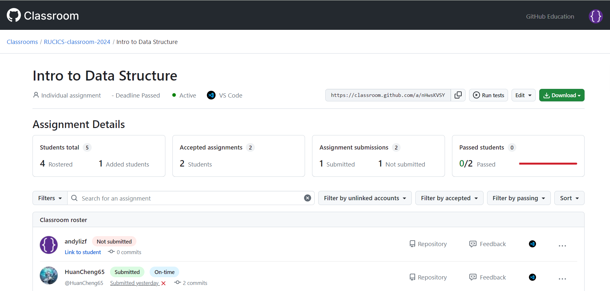

---
# You can also start simply with 'default'
theme: seriph
# random image from a curated Unsplash collection by Anthony
# like them? see https://unsplash.com/collections/94734566/slidev
background: https://plus.unsplash.com/premium_photo-1720287601300-cf423c3d6760?q=80&w=2070&auto=format&fit=crop&ixlib=rb-4.0.3&ixid=M3wxMjA3fDB8MHxwaG90by1wYWdlfHx8fGVufDB8fHx8fA%3D%3D
# some information about your slides (markdown enabled)
title: Welcome to Slidev
info: |
  ## Slidev Starter Template
  Presentation slides for developers.

  Learn more at [Sli.dev](https://sli.dev)
# apply unocss classes to the current slide
class: text-center
# https://sli.dev/custom/highlighters.html
highlighter: shiki
# https://sli.dev/guide/drawing
drawings:
  persist: false
# slide transition: https://sli.dev/guide/animations#slide-transitions
transition: slide-left
# enable MDC Syntax: https://sli.dev/guide/syntax#mdc-syntax
mdc: true
---

# ICS GitHub Submission 草案

李知非

---
transition: fade-out
---

# Existed Problems

以往的 Lab 提交流程存在以下问题：

1. DDL 临近时，提交人数激增；迟交现象严重，且未必反映在评分中
2. 代码提交不规范，导致评分困难
3. 评分过程繁琐，容易出错
4. 缺乏 Feedback，学生无法及时了解评分情况
5. 不易追踪学生的提交历史，以维护学术诚信

---
transition: slide-up
level: 2
---

# Introducing GitHub Classroom

GitHub Classroom 是 GitHub 提供的一个教学工具，可以帮助教师更好地管理课程、学生和作业，非常适用于计算机科学课程。

## 优势

- **自动化**：自动分发作业，自动截止提交
- **规范化**：以标准的 Git Workflow 进行代码提交，顺便学习 SCM
- **可追踪**：学生提交内容和历史一目了然，压缩可供 argue 的空间
- **实时评分**：学生可实时查看**目标环境**的评分情况
- **快速反馈**：学生存储库中的 Feedback PR 可以快速进行 Code Review

 
 

UC Berkeley CS161's [Experience](https://su24.cs161.org/proj2/policies/)

---
level: 2
---

# An Example Usage

## Classroom

---
level: 2
---

## Roster

---
level: 2
---

## Assignment

---
level: 2
---

## Streamlined Workflow

为了确保 Lab 提交的规范性和高效性，我们计划采用如下流程：

1. **创建 Classroom**：对每学期的课程创建一个 Classroom，导入学生名单，设置 TA
2. **分享 Classroom**：将 Classroom 链接分享给学生，学生加入 Classroom，选择对应学生名单中的真实姓名

对于每个 Lab：

1. **创建 Assignment**：每次 Lab 创建一个 Private Assignment，设置 Starter Code, Autograder 及 Deadline
2. **分享 Assignment**：将 Assignment 链接分享给学生，学生 Accept Assignment 后，自动对 Starter Code 进行 Fork
3. **提交 Assignment**：学生在 Fork 的存储库中进行代码编写，完成后提交 commits。TA 可随时在 Assignment Dashboard 查看提交和评分情况
4. **评价 Assignment**：在 Deadline 后，TA 可增加 Test Cases 并重新评分。TA 还可以在 Feedback PR 中提供具体评价和建议
5. **公布 Assignment**：TA 可在 Assignment Dashboard 中公布分数分布，还可将 Assignment 转为 Public 以供学生学习优秀实现

---
layout: center
class: text-center
---

# Thank You!

<PoweredBySlidev mt-10 />
